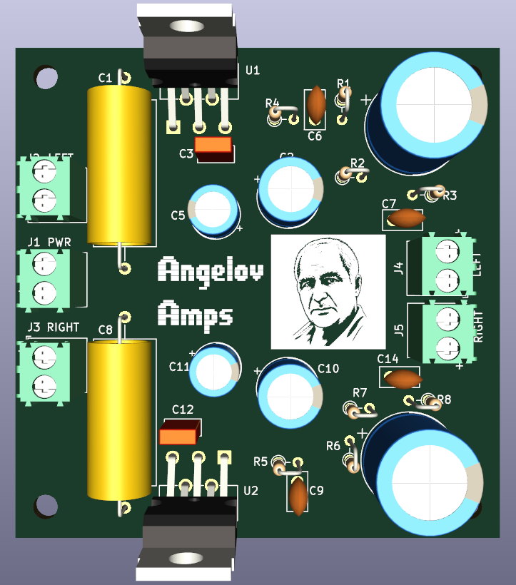
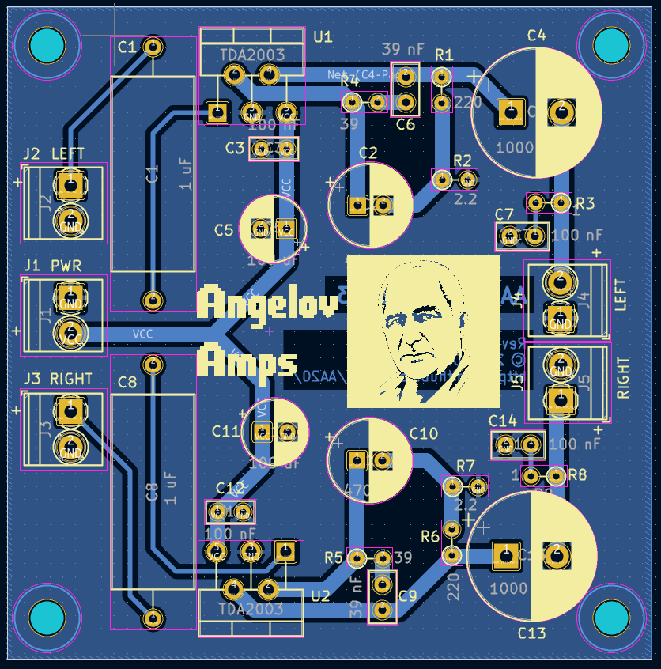
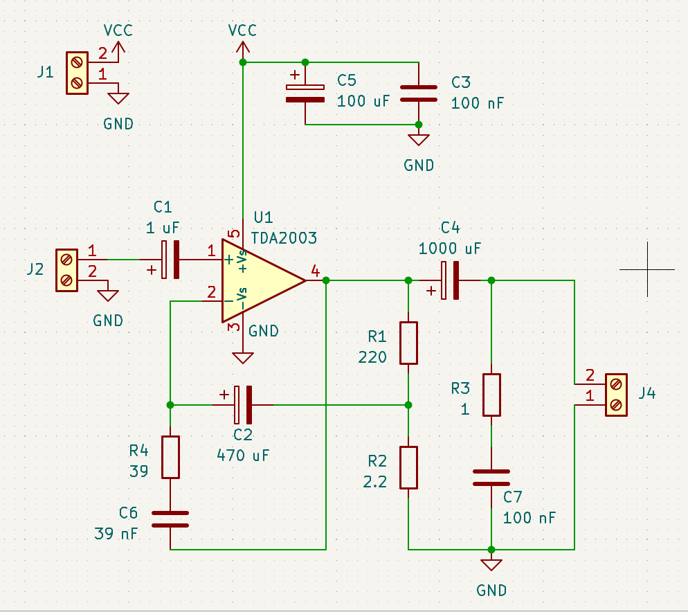
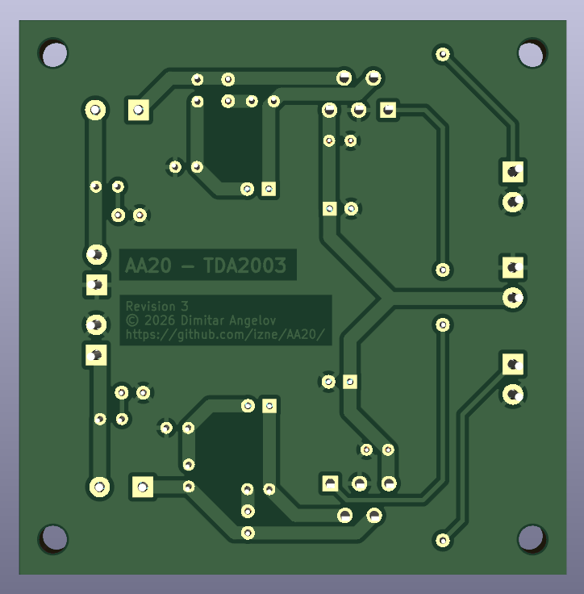

# AA20

A compact, high-fidelity audio amplifier PCB centered around the legendary TDA2003. 

## The Spirit of the TDA2003

There is something undeniably cool about the TDA2003. It packs a full Class B transistor amplifier into a single, robust package—a feat of engineering that remains a cornerstone of analog audio. While it belongs to an "old-school" era of design, it delivers that unmistakable, warm, and punchy transistor sound that modern digital chips often struggle to replicate. It's simple, it's powerful, and it's pure analog soul.

### Engineering Facts
The TDA2003 is a monolithic audio power amplifier IC designed as a low-frequency **Class B amplifier**. By utilizing a push-pull configuration, it achieves high power efficiency while maintaining low harmonic distortion. It is engineered for stability and reliability, featuring:
- **Monolithic Design:** Integrates the entire power amplifier circuit into a single chip.
- **High Power Output:** Capable of delivering significant power (typically 10W+) depending on the configuration.
- **Robust Protection:** Built-in features to handle typical operating stresses, making it a favorite for car audio and home stereo applications.

## Overview

AA20 is designed to be a small but mighty amplifier solution. The layout is specifically optimized for thermal performance, mounting the TDA2003 ICs sideways to facilitate efficient side-mounted heatsinking.

## Schematic & Design Philosophy

The circuit design is a direct implementation of the **TDA2003 reference schematic** provided in the official datasheet. To ensure maximum reliability and performance, all component values (capacitors, resistors, and diodes) are selected strictly according to the manufacturer's recommendations. 

This approach guarantees that the amplifier operates within its intended stability margins, providing the expected output power and low distortion while effectively managing the Zobel network for high-frequency stability.

## Performance Analysis (Theoretical)

Based on a **12V DC** supply and an **8 $\Omega$** load, the following performance characteristics are expected:

### Power Output
Using the relationship $P = \frac{V_{peak}^2}{2R}$, and accounting for the typical $V_{drop}$ of the TDA2003:
- **Estimated Output Power:** $\approx$ **2.5W to 3.5W per channel** at peak levels.
- **Current Draw:** With a 12V 2A supply, the system has ample headroom to drive both channels even under heavy transients.

### Thermal & Efficiency
- **Efficiency:** As a Class B amplifier, it offers higher efficiency than Class A, reducing wasted energy.
- **Heat Dissipation:** At peak output, each channel will dissipate significant heat. The side-mounted heatsink configuration is critical to maintaining junction temperatures within safe limits.

### Audio Fidelity
- **Total Harmonic Distortion (THD):** Expected to be **< 0.1%** at rated power, providing clean, high-fidelity audio.
- **Frequency Response:** Designed to cover the full audible spectrum (**20Hz to 20kHz**) with a flat response, thanks to the optimized Zobel network.

## Technical Specifications

### PCB Design
- **General Traces:** 1.5mm width for robust power and high-current paths.
- **Signal Traces:** Precision 0.5mm width for clean audio signal paths.
- **Zobel Network:** 0.5mm trace width for critical stability components.
- **EDA Tool:** KiCad

### Electrical & Load
- **Integrated Circuit:** TDA2003
- **Power Supply:** 12V 2A single power brick (shared across both channels).
- **Speaker Load:** 8 $\Omega$ (15W speakers).

## Visuals

| Schematic | Bottom View |
| :---: | :---: |
|  |  |

## Hardware Notes

- **Thermal Management:** The TDA2003 components are oriented sideways. **A dedicated heatsink must be mounted to the side of the ICs** to ensure stable operation and prevent thermal shutdown.
- **Assembly:** Follow the datasheet reference schematic closely, particularly for the Zobel network placement, to ensure maximum stability and prevent oscillation.

## Files

- `Signal/`: KiCad project files (`.kicad_pro`, `.kicad_sch`, `.kicad_pcb`).
- `Gerbers/Signal/`: Production-ready Gerber files (`rev3.zip`).

## License

[Specify License, e.g., MIT]